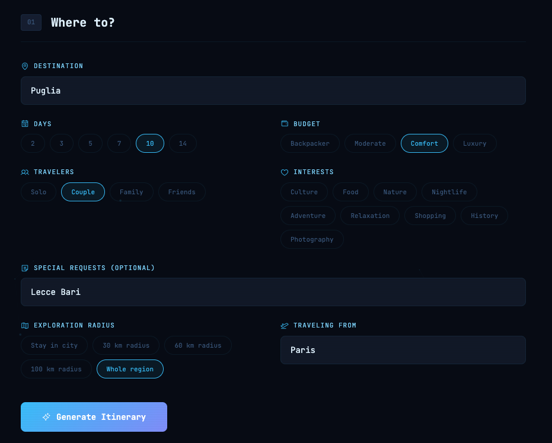
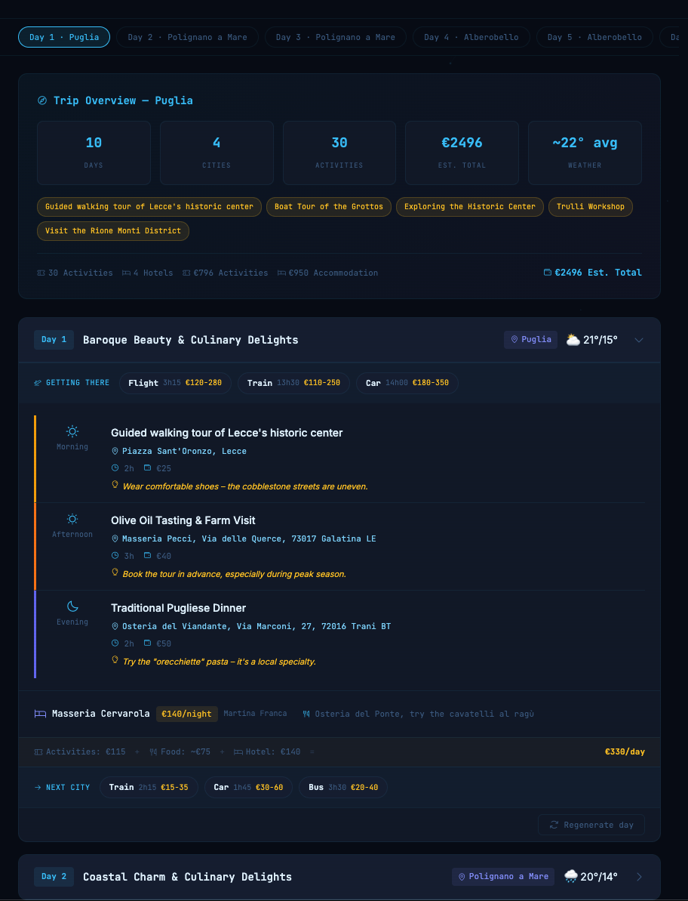

<div align="center">

# Wandr

**AI Travel Planner — Day-by-Day Itineraries with Live Data**

Give a destination, budget, and number of days. Get a detailed itinerary with real weather forecasts, local currency, transport tips, and food recommendations.

</div>

---

## Screenshots

| Input | Output |
|-------|--------|
|  |  |

---

## Features

| Feature | Description |
|---------|-------------|
| **AI Itinerary** | Morning/afternoon/evening activities with locations, durations, costs, and tips |
| **Live Weather** | Real forecast via Open-Meteo (no API key) — shown per day |
| **Geocoding** | Auto-locates destinations via Nominatim/OpenStreetMap |
| **Local Currency** | Shows costs in the destination's currency |
| **Budget Levels** | Backpacker, moderate, comfort, luxury — adjusts recommendations |
| **Traveler Types** | Solo, couple, family, friends — tailored suggestions |
| **Interests** | Culture, food, nature, nightlife, adventure, relaxation, shopping, history, photography |
| **Save Trips** | Persist to local `trips.json` file — survives browser cache clears |
| **Copy & Print** | Export as text or print-friendly format |

---

## Quick Start

```bash
# 1. Make sure Ollama is running
ollama serve

# 2. Start the server
node server.js

# 3. Open
open http://localhost:3000
```

---

## APIs Used (all free, no tokens)

| API | Purpose |
|-----|---------|
| [Open-Meteo](https://open-meteo.com) | Weather forecast (16 days) |
| [Nominatim](https://nominatim.openstreetmap.org) | Geocoding (lat/lon from place name) |
| [Ollama](https://ollama.ai) | Local LLM for itinerary generation |

---

## Architecture

```
├── server.js           ← Local server (static files + trips persistence)
├── trips.json          ← Saved trips (auto-generated, gitignored)
├── index.html
├── styles.css
└── js/
    ├── app.js          ← Bootstrap + UI utils
    ├── core/
    │   ├── state.js    ← Global state
    │   ├── ollama.js   ← LLM communication
    │   ├── apis.js     ← Weather, geocoding
    │   └── utils.js    ← Helpers + persistence
    └── features/
        ├── planner.js  ← Trip generation & rendering
        └── saved.js    ← Save, load, copy, print
```

No frameworks. No build step. ES modules.

---

*No API keys. No accounts. Weather data is real. Itineraries are AI-generated locally.*
